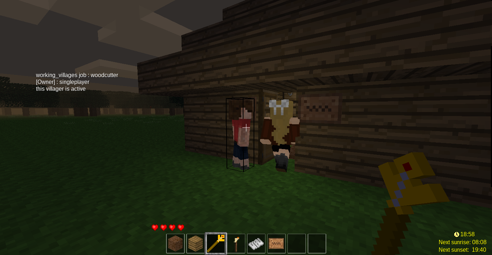
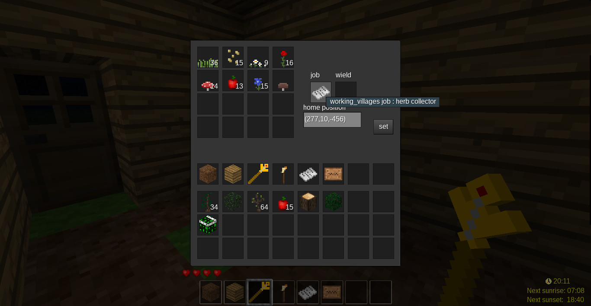
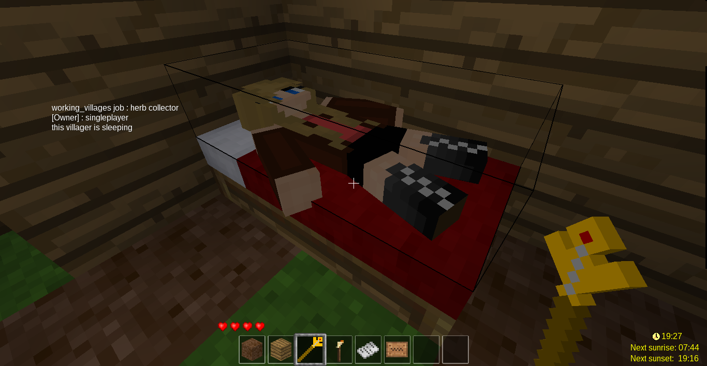
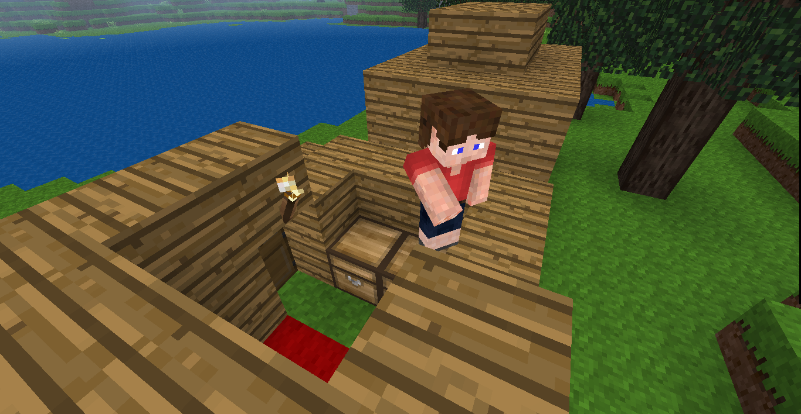

# minetest mod working_villages
[![luacheck][luacheck badge]][luacheck workflow]  
This mod adds Villagers performing work.
The plan is to make villagers build up their own villages.

[working_villages forum page](https://forum.minetest.net/viewtopic.php?f=9&t=17429)

## Planned Features
* villages
  * built up by the villagers
* villagers
  * trading and building up an economy
  * working / doing their jobs
* jobs
  * miner, farmer, woodcutter and many more

* realism
  * villagers experience hunger, stamina and other effects
  * villagers use tools, integrated with tool ranks
  * drop inv, bones on death
* more realism
  * integration with getname
  * mobs_redo-like offspring and lineage-tracking
  * => randomly generated stories
  * generation of histories & other heirlooms
  * => randomly generated villages with high rank items with cool backstories
* more jobs
  * blacksmith: repairs tools
  * craftsmen:  higher level crafts needed for builder, salesmen and military
    * build on a single craftsman AI, but limited to certain recipes for simplying automation
      => mineables go to the mason
      => choppables go to the carpenter
      this will help regulate how much of each material goes to each recipe,
      which make it easier to build a pipeline from raw resources to an overpriced retail front
      combined with toolranks and tool repair, we might be able to make products worth buying
* clothing, armor, upgrades
  * I think the mods add inv lists to the player for these, so likewise can be done to the villagers
* starfleet
  * need some way for flyingships-like mods to notify villagers that all their location data just got teleported

* expose job functions to create meta-jobs that switch between jobs, eg
  * for a pioneer AI that finds a good spot, inits the area, and switches to mayor tasks)
  * for a manager-type that can jump in to help team members
* maybe make a recipe to convert other mod's building signs to ours and vice-versa
* egg-registering integration


## implemented Features
no crafting recipes yet (you will have to use creative)
features:
* building markers
  * for building houses and saving the houses details
  * save the position of the door and the bed
  * some jobs will let the villagers return home at night
  * at home the villagers will go to bed
* spawn-eggs for villagers
  * female and male
  * (just for a nicer look)
* commanding sceptre
  * leftclick villagers to let them pause their work
  * rightclick villagers to open the inventory
  * items can be exchanged in the inventory
  * home can be set in the inventory
  * jobs can be changed in the inventory
* jobs
  * jobs define what the villagers should do
  * jobs can be changed in the inventory by clicking change job
  * in the job change form the jobs can be changed by replacing the current job by one of the jobs below (shift+click possible)
* registered jobs:
  * woodcutter/lumberjack (cutting trees and planting saplings)
  * plant collector (collecting all sort of fauna to produce dyes etc.)
  * player follower (following any player, night active)
  * builder (builds the nearest building defined by a building marker)
* testing jobs:
  * snowclearer (clearing snow away)
  * torcher (following player and placing torches in the dark, night active)

for developing jobs, villagers, etc. read [api.md](api.MD)

## screenshots





## Submodules
Currently working_villages only has the modutil portable submodule.
It is needed to be able to run without the modutil mod.  
This means you can either download the modutil mod and enable it or get the submodule:

When cloning add "--recursive" option to clone including all submodules:
```
git clone --recursive https://github.com/theFox6/working_villages.git
```

If one of the submodule folders is empty use:
```
git submodule update --init
```
This will clone all missing submodules.

## Dependencies
working_villages needs modutil to load utilities it can also use modutil portable though  
doors can be used by the villagers that's why there is a dependency

## missing modutil
If you clone the mod you either need to **install and activate the modutil mod** or you need to **[clone it recursively](#cloning)**.  
If modutil is not present you will get the following error:
`.minetest/mods/working_villages/modutil/portable.lua: No such file or directory`

## cloning
When cloning first add "--recursive" option to clone including all submodules:
```
git clone --recursive https://github.com/theFox6/working_villages.git
```
else the submodule folders will be empty.

If one of the submodule folders is empty use:
```
git submodule update --init
```
This will clone all missing submodules.

To pull all changes in the repo including changes in the submodules use:
```
git pull --recurse-submodules
```

## License
* working_villages by theFox6 is avalible under the MIT License

Exceptions to the above:
* villager skin textures from the Homedecor mod: CC-by-SA 3.0 or higher
* the base of the api is the source code of the Maidroid mod: [LGPLv2.1](https://www.gnu.org/licenses/old-licenses/lgpl-2.1.txt) or later license.
* the egg textures are included in the Maidroid mod: [CC-BY-SA 4.0](https://creativecommons.org/licenses/by-sa/4.0/) or later license.
* the letters texture is from the Memorandum mod
* the sign textures and the base of the torcher job texture are from the default mod in minetest_game and from Gambit: CC BY-SA 3.0
* horsetail texture as base for the herb collectors job texture from Mossmanikin's Ferns: CC-By-SA 3.0

[luacheck badge]: https://github.com/theFox6/working_villages/workflows/luacheck/badge.svg
[luacheck workflow]: https://github.com/theFox6/working_villages/actions?query=workflow%3Aluacheck
